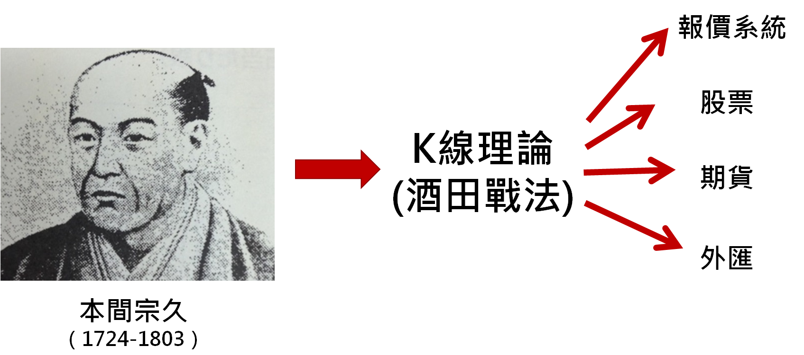
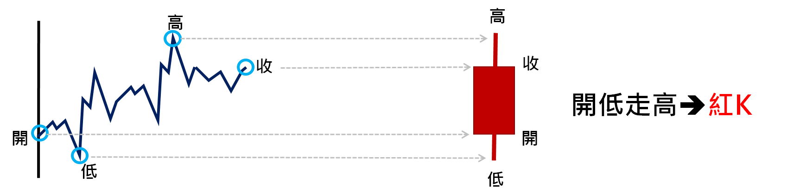
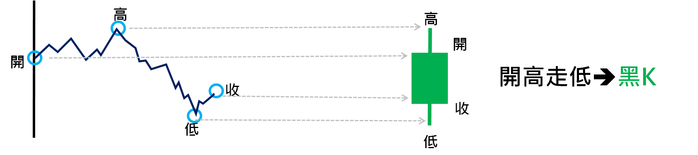
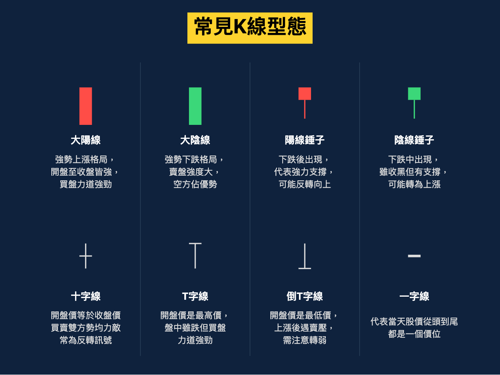
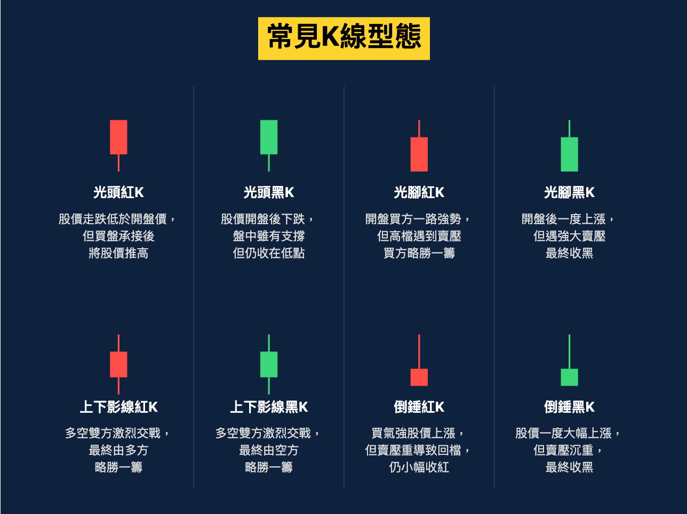

# 交易入门

## 一、K线

### 概念

K线是根据股价一天走势中形成的4个价位,即开盘价、收盘价、最高价、最低价所形成,显示出市场某段期间的价格变化,包含了股票、ETF、期货、外汇等等商品

K线在不同周期的计算上也有分别,记录一天股价变化的称为日K线,一周股价称为周K线,一个月股价变化称为月K线,通常短期投资人是以观察日线为主的

K线图又称蜡烛图、阴阳线,据传K线为日本江户时代的白米商人本间宗久所发明,用来记录每日的米市行情,本间宗久本身也是一位操盘交易大师,他的行情分析战术更近一步发展成为所谓的`酒田战法`

K线因其绘制方法及逻辑有其独到之处,后人把它引入价格走势的分析中,经过了300多年的发展,已经是各种报价软件的主流线图,并广泛应用于期货、外汇、期权等证券市场



### K线如何绘制而成?

K线的绘制方法是找到当日最高和最低价,垂直连成一条直线,然后再找到开盘价和收盘价,将此两个价位连成一条狭长的长方柱体


若收盘价高于开盘价,也就是股价上涨的时候,以红色表示,称为`阳线`



反之收盘价低于开盘价,股价下跌的时候,以绿色表示,称为`阴线`




### 常见的K线形态





- 上升趋势: 通过买家强劲的动能拉动,形成了新的顶顶高和底底高,新的高点突破代表上升趋势延续,股价继续走高和看涨,新的低点如果跌破的话,可能意味着趋势的反转
- 下跌趋势: 透过卖家抛售的动能形成了新的顶顶低以及新的底底低,新的低点跌破代表下跌趋势延续,新的高点突破的话代表趋势的反转


## 二、成交量

`成交量`是指某一时段内具体的交易数量,通常用柱状图表示,成交量的变化会反映资金进入市场的情况

在交易所中,每一笔交易都必须有`买方`和`卖方`,交易才可以完成,`买单`和`卖单`必须撮合成功,才可以产生成交量

简单的说,你能买到,说明有人卖;你能卖出,说明有人买;

成交量的背后,同时有一组买方和卖方,因此成交量大,并不只有买的人多,同时也代表卖的人多,同样的,成交量越小,代表买的人很少,也可能代表卖的人少

因此,要搭配K线图/趋势来解读

```
K线 = 方向盘
成交量 = 油门 = 市场对涨跌(价格)的分歧程度
```

一般分为四种:

**- 价涨量增**

股价上涨,成交量也随之增加,资金不断涌入,股价上涨代表的是买方需要付出更高的成本,但市场需求依然很大,处于狂热利好的状态

总结: 买方力量强 + 卖方愿意成交

**- 价跌量缩**

股价下跌,成交量也随之减少,这种情况意味着市场没有什么人愿意交易

总结: 买方(观望)卖方(惜售)等待机会,盘整或者震荡

**- 价跌量增 (背离情况)**

股价下跌,成交量随之增大,通常持股者就是因为恐慌抛售自己的股票

总结: 卖方力量强 + 买方接不住

**- 价涨量缩 (背离情况)**

股票上涨,但是成交量随着减少,通常健康的上涨都需要成交量的支持,如果上涨过程中成交量萎缩,就要警惕假突破或者是诱多,后续如果没有成交量放大支撑,价格可能很快会回落

总结: 买方力量强 + 卖方惜售


## 三、MA移动平均线

> MA = MOVING AVERAGE 

一般市场上基本就是`MA/EMA/WMA`

`均线`是将某一段时间周期内的收盘价之总和再除以该周期的天数,将得到的数字连成一条线

```
// 每日的收市价权重相同
10MA  = 从当前开始过去10天的收盘价总和 / 10

// 今日收市价权重最大
// 1. 计算平滑系数
α = 2 / (10 + 1) = 0.1818, 10代表的是10EMA
// 2. 计算10日EMA
10EMA = α x 当前收盘价格 + (1 - α) x 前一日EMA

```

#### EMA通常用来判断趋势方向和价格动能

**1. 趋势判断**

    - EMA上升 -> 价格趋势向上(多头市场)
    - EMA下降 -> 价格趋势向下(空头市场)

**2. 支撑与阻力**

    - 价格回调至EMA附近,若反弹,则EMA可能是支撑位
    - 价格反弹至EMA附近,若回落,则EMA可能是阻力位    
    
**3. 均线交叉信号(如20EMA & 50EMA)**

    - 短期EMA上穿长期EMA(黄金交叉) -> 看涨信号
    - 短信EMA下穿长期EMA(死亡交叉) -> 看跌信号

## 四、MACD

MOVING AVERAGE CONVERGENCE 指数平滑异同移动平均线,是由Geral Appel于1979年提出的,利用收盘价的短期(常用为12天)指数移动平均线与长期(常用为26天)指数移动平均线之间的聚合与分离状况,对买进、卖出时机做出研判的技术指标

**主要是由两条线和中间的柱状组成**

DIF:反应在一段时间内股价的变化情况,12日EMA - 26日EMA (快),当DIF为正,上穿0轴,说明短期均线(12EMA)高于长期均线(26EMA),为负,说明短期均线(12EMA)低于长期均线(26EMA)

DEA: DIF的均线的9日平均值EMA,DIF / 9DAYS (慢),DIF本身变化太快,容易受到短期价格波动的影响,所以为了进一步的`平滑趋势`,作为我们的慢线

BAR柱状图: `(DIF - DEA) x 2`,反应的是快线和慢线两线之间的距离

***快线慢线的位置**

- 如果都在0轴以上的话,表示近期股价上涨 
- 如果都在0轴以下的话,表示近期股价下跌

**如果发生两条线交叉的情况**

- 当快线超过慢线,就是产生买入信号,黄金交叉
- 当慢线超过快线,就是产生卖出信号,死亡交叉


**BAR柱状图**

- 当柱体位于0轴上方时候会显示绿色,趋势向上
- 当柱体位于0轴下方时候会显示红色,趋势向下


## 五、RSI

RSI 相对强弱指标

越接近0值表示卖方力量越强,市场上大量抛售股票
越接近100表示买方力量越强,市场上大量买入股票

```
// 超卖和超买
RSI > 70% 表示超买
RSI > 30% 表示超卖

// 顶背离和底背离
顶背离:当资产价格不断创新高,但是RSI指数没有再创新高,意味着上升的动力不断放缓,买方的力量开始减弱
底背离: 当资产价格不断创新低,RSI并没有再创新低,意味着卖方的力量开始减弱了,背离的时间越长,反弹力度越大
```

## 六、BOLL

布林线主要是由三条线组成:

- 上轨线: 移动平均线 + 2倍标准差
- 中轨线: 移动平均线,同MA原理相同
- 下轨线: 移动平均线 - 2倍标准差

**1. 压力和支撑**

- 上轨用于压力,突破上轨,属于超买
- 下轨用于支撑,跌破下轨,属于超卖

**2. 股价强弱走势**

- 股价在中轨和上轨之间,强势
- 股价在中轨和下轨之间,弱势

**3. 开口和缩口**

- 开口:上轨线向上移动,下轨线向下移动,类似一个开口,说明股票的波动幅度正在增加
- 缩口:上轨线向下移动,下轨线向上移动,类似一个缩口,说明股票的波动幅度正在减少

Boll线实际就是从MA演变而来的,MA实际就是使用过往的数据来解释今天的结果,会有滞后性,通常布林线使用的是MA20移动平均线

**如何使用布林线寻找买点**

K线从下轨穿出中轨就是第一个买点,假如趋势延续,每次K线从上轨回落到中轨都可以再加注

**如何使用布林线寻找卖点**

简单的说,跌破中轨就是卖出信号

## 七、趋势线

把相邻的两个高点或低点连接而成的一条直线 

如果后一个低点比前一个低点高,说明价格趋势向上,连接起来的线叫做支撑线,相反,如果后一个高峰比前一个高峰低,说明价格趋势向下,叫做阻力线

趋势线必须连接两个很明显且重要的低点,当第三点价格回落到趋势线有明确反转的时候,表示市场是按照趋势线的

画趋势线不能穿过K线实体部分

趋势线是一段`上涨`或者`下跌`行情,画出趋势线的目的是确定趋势是否延续或者趋势是否会出现反转

**如何寻找支撑和压力位**

- 接触次数越多越好
- 有过强烈的反应
- 一眼就可看到
- 同时做过支撑位和压力位

日内交易的话,只需要关注分钟级别的支撑和压力即可

**如何判断趋势发生变化了**

这个可以帮助我们逃顶和抄底,我认为,我们需要准确的知道相对的底部和顶部才可以赚到钱.从日线级别来看,我们现货需要知道一段上涨的趋势什么时候结束,结束后,我们应该止盈一部分利润,相对低点的时候再根据趋势的判断抄一些底部的筹码.从日内交易商来讲,我们从低点买入,高点卖出,也是依赖于我们对于趋势的判断.

- 跌破趋势线

首先,我们需要判断出当前是上涨,下跌,还是震荡,震荡不需要画出趋势线,上涨或者下跌的时候,将趋势画出来,一旦未能保持当前趋势的话,我们则可以考虑趋势反转

- 金K

在趋势线的上涨或者下跌过程中,出现异常的K线更可以让我们提前判断趋势的反转

由多转空: 看跌吞没 / 流星线 / 黄昏星 / 乌云盖顶

由空转多: 看涨吞没 / 锤型线 / 启明星 / 刺透

- 均线法则

1. `破线`: K线跌破/突破短期均线
2. `拐头`: 短期EMA开始向上/向下拐头
3. `交叉`: 短期EMA逐步与中期、长期EMA交叉
4. `排列`: 短期、中期、长期EMA出现多头/空头排列
5. `乖离`: 开始出现大幅乖离


## 八、多空比和资金费率

你下了一张开多的订单,意味着你希望以某个价格买入合约,预期价格上涨

市场中必须有一个人同时愿意以同样的价格开空合约,预期价格下跌.这一点保证了市场中多单和空单的合约数量相等

**多单合约 = 空单合约**

- 账户数量统计

多空比(账户数量) = 开多账户数量 / 开空账户数量

假如市场中有1000个账户持有多单,800个账户持有空单,多空比 = 1000 / 800 = 1.25(>1看涨,<1看跌)

看多的账户更加分散,每个账户开的小单较多,看空的账户更加集中,少数账户持有更大的仓位

- 资金量统计

多空比(资金量) = 开多资金量 / 开空资金量

多空比 = 10,000,000 / 8,000,000 = 1.25

这个多空比表示,市场中更多的资金在押注价格上涨

- 持仓量(未被平仓的合约)

多空比(持仓量) = 多单持仓量 / 空单持仓量

反映了市场中尚未关闭的头寸总数,通常用来衡量市场的活跃程度和参与度


交易所的集中玩法:

- 现货
- 现货杠杆 2x 3x 5x 借钱然后还利息
- 期权
- 期货合约 在一定期限内交割的合约:季度合约、七天合约
- 永续合约 随时可以平仓交割的合约

资金费率只有在永续合约中才有,合约的价格是跟随现货的,合约市场的价格偏离现货的价格过大,做多的多,那么,要收做多人的钱去补贴做空的人,做空的多,那么要收做空的人去补贴做多的人


## 九、永续合约入门

- 辨识趋势

**趋势一旦形成,很难在短时间内改变**

上涨趋势: 连续抬高的高点,连续抬高的低点

假设BTC下跌过程中,可以观察哪些币种的反弹最猛、下跌程度相对较低,可以理解为是强势币种

- 确认强势

**核心:只做强势币种的趋势**

- 熟悉形态

- 支撑进场

- 趋势结束出场

**全仓模式:** 整个账户的可用余额都可以用于维持仓位的`保证金`,避免被强制平仓

假设你有10,000USDT的资金,开了一张比特币的多单,初始保证金是2,000USDT,如果市场下跌,在全仓模式下,账户中剩余的8,000USDT会自动补充这笔订单的保证金,只要账户内仍有余额,仓位就不会被强平,只有当账户可用资金耗尽的时候,仓位才会被强制平仓.

**逐仓模式:** 每个仓位的保证金都是独立的,亏损只影响该仓位,不会影响账户内的其他资金

假设你仍然有10,000USDT资金,在逐仓模式下开了一张比特币的多单,初始保证金2,000USDT,如果市场下跌导致亏损达到2,000USDT,这个仓位会被强平,但账户内剩余的8,000USDT不会受影响,逐仓模式可以人为控制最大损失,即便账户里面还有钱,系统也不会自动补充该仓位的保证金


