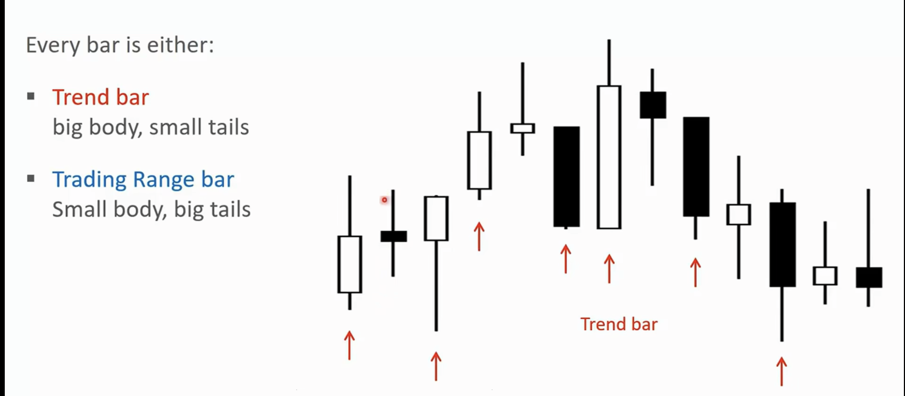

## 价格行为学

### 图表基础

**图表类型**

蜡烛图比较适合日内交易

**市场如何工作**

### 蜡烛图 & 交易区间 & K线

K线分为`趋势K线`,`交易区间K线`

趋势K线: 实体比较大,很小的影线
交易区间K线: 实体比较小,影线比较长

当市场处于趋势的时候,80%的反转尝试都会失败

市场是有惯性的,大部分情况下会延续当前的趋势

在当前K线之前市场的走势,远比当前K线的形态重要的多

仅仅依靠K线形态是没有用的

- 支撑位和压力位
- 移动平均线
- 通道

**重点: 在阻力位卖出,在支撑位买入的交易者才是价值投资者**

**当市场出现强势突破的时候,强势上涨和强势下跌,最好顺着趋势去做**

**买入单最好是在信号K的最高价的上方一点点买入,卖出单也最好是在信号K的最低价的下方一点点卖出**

### 市场周期

突破 -> 通道 -> 震荡 -> 突破

- 突破(强趋势)

止损点: 突破的起涨点,跌破表明上涨趋势结束,否则就是回调

- 窄通道(强趋势)

紧贴趋势线运行,回调幅度小,且不超过3跟K线

依然是只能做多,不能做空

- 宽通道(弱趋势)

回调的幅度比较深,但总体的高低点都在抬高

依然比较适合拿着

- 震荡区间

在下沿附近做多,在上沿附近做空,高抛低吸

市场在`趋势`和`交易区间`之间交替

每个趋势都由`突破阶段`组成,即最初的大趋势K线或一系列趋势K线,然后是`通道阶段`,通道阶段是被限制在两条线之间的上升或者下降趋势

通道最终会变得更加平缓、更宽阔,进而演变成`交易区间`

交易区间最终会突破

如果你观察任何一个`交易区间`,通常可以看到牛市趋势和熊市趋势的开端

趋势如果很强劲,那么就是`突破`,否则就是`通道`,通道阶段如果比较狭窄陡峭可以看做是强势,否则就是类似交易区间一样的宽通道,更适合`高抛低吸`....

假如市场上涨

- 牛市趋势
    - 只考虑买入
    - 至少要有一部分的仓位
- 交易区间内的上涨
    - 抓住买入信号
    - 卖出信号的时候卖出

假如市场下跌

- 熊市趋势
    - 只考虑卖出
    - 至少平掉部分仓位
- 交易区间内的下跌
    - 抓住卖出信号
    - 买入信号的时候买入

### 止损

1. 知道现在是什么市场周期,并且可以识别市场周期的转变信号

2. 知道什么时候可以入场,如何入场

3. 入场之后,如何管理手里的仓位

4. 软实力,心态

5. 可以亏损,但是不能大亏

大脑会正当化你的错误行为,找各种不止损的理由,并且害怕再次犯错,害怕涨上去

- 上涨趋势
    - 重要的低点:高低点不断抬高,找到创新高的起涨点(低点),可以作为止损点
    - 阻力位
    - 提前离场

- 下降趋势
    - 重要的高点
    - 支撑位
    - 提前离场

止损的原则: 重要的地点被跌破,上涨趋势的前提可能不再成立,市场可能已经进入震荡区间,甚至反转成下降趋势

强下降趋势/窄下降通道,第一次反转尝试,大概率失败,多头要等待第2次做多入场点,空头可以在第2做多入场点离场,通常是小双底结构

### 突破

为什么很多突破会失败?

什么样的突破成功率高？

反转也是一种突破？

弱突破容易有比较深的回调？

首先,市场具有惯性,80%的尝试突破行为都会失败,你可以认为,突破需要反复尝试..至少两次?

个人认为一般第一次的突破基本上都是失败的,至少2到3次以上的突破在震荡区间内形成,而且量能比较大,我可以认为是真突破,否则我认为必定是假突破

突破需要确认和跟随,没有跟随是无法确认是真突破的

成功率高的突破特征:

- 突破K体积大
- 收在最低/最高,几乎没有影线
- 离之前的区间足够远
- 被突破的K线数量很多
- 突破K的形成有急迫感

突破后为什么需要回踩确认呢？阻力变支撑?

并不是所有的突破都会回踩的

### 支撑位判断与反转信号识别

判断支撑位是否有效,关键在于反弹的“力度”和“信号”

✅ 支撑位有效的表现:
- 强力反弹:出现大阳线、放量、快速远离支撑位 → 表示买盘强势，有可能是反转起点

- 底部形态初现:如双底、头肩底、锤子线、看涨吞没、十字星组合（如阴线+十字星+大阳线）

- 量能配合:支撑反弹伴随成交量放大，表明资金开始入场

- 技术指标共振:如 MACD 金叉、RSI 回升,增强支撑有效性的信号

- 关键位置重合:若当前支撑位曾是历史压力位，说明支撑更可靠（即“支撑-压力互换”）

❌ 支撑位无效的特征:

- 反弹无力:小阳线、缩量、反弹乏力后再次下跌

- 没有形态:无典型K线结构或指标配合

- 无法站稳:反弹后又快速回落，甚至跌破前低

📌 这种情况下,市场往往会继续下跌,寻找下一个有效支撑位

⏸️ 横盘 ≠ 反转
横盘只是暂时止跌,而非趋势反转

只有价格明确突破横盘区上沿,配合放量和技术指标改善,才可能确认趋势反转

> 支撑位的有效性 = 反弹力度 + 底部K线形态 + 放量支持 + 指标共振

### 压力位突破的判断与策略

在阻力位置,我们判断价格是突破还是反转向下?

根据我的实战经验，在阻力位置,80%的压力位突破其实都是假突破。真正有效的突破，往往具备几个关键特征:

✅ 真突破的典型特征:

- 放量+大阳线，直接突破关键压力位（如前高、趋势线或均线）

- 实体K线有效站稳压力上方

- 后续走势具有延续性

- 多个技术点共振（例如同时突破前高+下降趋势线+MA60）

📌 止损建议：可将止损设置在突破大阳线的实体下方一点点，防止被“插针洗盘”。

❌ 假突破的典型表现:

- 突破时成交量不足

- K线长上影线或十字线，多为冲高回落

- 收盘无法站稳压力位

- 突破后无延续性，甚至快速跌回原区间

上涨回落后基本都会跟随放量的下跌,市场会寻找支撑,这时候也不要着急抄底,观察量小止跌后,等待价格突破

### 短线战法

**1. 支撑位买入 + 压力位卖出**

📌适合震荡行情 / 趋势中的回调买入

✅ 操作逻辑：

- 识别历史成交密集区、前期低点、趋势线、均线作为支撑位

- 在支撑位附近 观察是否出现止跌信号
    - 放量阳线
    - 反包K线
    - 锤子线、十字星
    - MACD金叉、RSI回升

✅ 进场：
首次触及支撑可轻仓试探，等出现明确K线形态后加仓

✅ 止损：
- 明确设好止损：跌破支撑一定要认赔离场

- 可以等待下一次止跌信号再二次进场

✅ 离场：
- 靠近压力位或出现放量滞涨/长上影K线时止盈

- 观察关键阻力（前高、箱体上沿）是否放量突破

**2. 突破(主升段吃肉/追高)**

适合趋势启动、平台突破行情

✅ 操作逻辑：

- 等待价格在关键位置震荡盘整

- 例如：平台整理、箱体震荡、均线压制

- 出现放量+大阳线+突破关键位时视为信号

✅ 成功突破的特征：

- 成交量明显放大（放量 = 信心）

- K线实体长、阳线收盘站稳关键位

- 多重共振（MACD金叉、趋势线突破、箱体/均线突破）

⚠️ 风险控制：

- 假突破常见特征：缩量、长上影、次日回落跌破关键位

- 设好止损位（通常在突破K线低点以下）

**3. 震荡高抛低吸(箱体战法)**

📌 适合震荡市、无明显趋势的市场

✅ 操作逻辑：

- 明确震荡区间的上下边界（箱体）

- 结合历史高低点、成交密集区

- 区间操作节奏：

    - 箱底附近低吸（出现止跌信号进场）

    - 箱顶附近高抛（滞涨信号或长上影时减仓）

✅ 补充策略：

- 多次震荡后，可能演化为突破行情，要防止“箱体思维”限制视角

- 可用均线系统（如EMA5/10）辅助判断转强或转弱

### 判断主力开始接盘了 & 抄底

### 判断主力派发 & 逃顶

