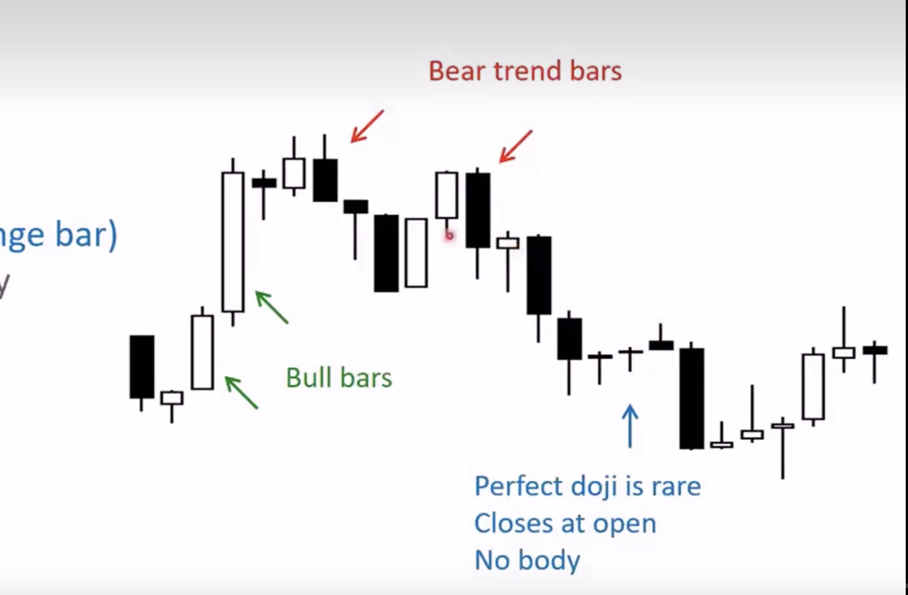

## 价格行为学

### 图表基础

**图表类型**

蜡烛图比较适合日内交易 

K线分为趋势K线、多头趋势K线、空头趋势K线、盘整区间K线

**市场如何工作**

股票市场将买家和卖家聚集在一起,市场永远都在找到一个买卖双方都觉得公平的价格

市场不断波动并产生合理价格,如果价格感觉过高,则会下跌,如果感觉价格太低,则价格会上涨

多数情况下,价格会横盘...

市场总是希望有更多的交易,市场的目的就是促进交易,尽可能的在一个交易区间内让买方和卖方达到一个平衡,因为在交易区间内的交易是最活跃的

### 蜡烛图 & 交易区间 & K线

**趋势线和交易区间K线**

K线分为`趋势K线`,`交易区间K线`

趋势K线: 实体比较大,很小的影线
交易区间K线: 实体比较小,影线比较长

当市场处于趋势的时候,80%的反转尝试都会失败

市场是有惯性的,大部分情况下会延续当前的趋势

在当前K线之前市场的走势,远比当前K线的形态重要的多

仅仅依靠K线形态是没有用的

- 支撑位和压力位
- 移动平均线
- 通道

重点: 在阻力位卖出,在支撑位买入的交易者才是价值投资者

当市场出现强势突破的时候,强势上涨和强势下跌,最好顺着趋势去做

买入单最好是在信号K的最高价的上方一点点买入,卖出单也最好是在信号K的最低价的下方一点点卖出

**信号K线和入场K线**

信号K线: 让你想要进行交易的K线,它发出了信号

入场k线: 下单交易的K线

不要等待非常完美的入场机会,否则可能永远等不到....

好的趋势一定要有跟随....

### 市场周期

突破 -> 通道 -> 震荡 -> 突破

- 突破(强趋势)

止损点: 突破的起涨点,跌破表明上涨趋势结束,否则就是回调

- 窄通道(强趋势)

紧贴趋势线运行,回调幅度小,且不超过3跟K线

依然是只能做多,不能做空

- 宽通道(弱趋势)

回调的幅度比较深,但总体的高低点都在抬高

依然比较适合拿着

- 震荡区间

在下沿附近做多,在上沿附近做空,高抛低吸 

市场在`趋势`和`交易区间`之间交替

每个趋势都由`突破阶段`组成,即最初的大趋势K线或一系列趋势K线,然后是`通道阶段`,通道阶段是被限制在两条线之间的上升或者下降趋势

通道最终会变得更加平缓、更宽阔,进而演变成`交易区间`

交易区间最终会突破

如果你观察任何一个`交易区间`,通常可以看到牛市趋势和熊市趋势的开端

趋势如果很强劲,那么就是`突破`,否则就是`通道`,通道阶段如果比较狭窄陡峭可以看做是强势,否则就是类似交易区间一样的宽通道,更适合`高抛低吸`....

`80%的突破`都会失败

### 支撑位判断与反转信号识别

判断支撑位是否有效,关键在于反弹的“力度”和“信号”

✅ 支撑位有效的表现:

- 强力反弹:出现大阳线、放量、快速远离支撑位 → 表示买盘强势，有可能是反转起点

- 底部形态初现:如双底、头肩底、锤子线、看涨吞没、十字星组合（如阴线+十字星+大阳线）

- 量能配合:支撑反弹伴随成交量放大，表明资金开始入场

- 技术指标共振:如 MACD 金叉、RSI 回升,增强支撑有效性的信号

- 关键位置重合:若当前支撑位曾是历史压力位，说明支撑更可靠（即“支撑-压力互换”）

❌ 支撑位无效的特征:

- 反弹无力:小阳线、缩量、反弹乏力后再次下跌

- 没有形态:无典型K线结构或指标配合

- 无法站稳:反弹后又快速回落，甚至跌破前低

📌 这种情况下,市场往往会继续下跌,寻找下一个有效支撑位

⏸️ 横盘 ≠ 反转
横盘只是暂时止跌,而非趋势反转

只有价格明确突破横盘区上沿,配合放量和技术指标改善,才可能确认趋势反转

> 支撑位的有效性 = 反弹力度 + 底部K线形态 + 放量支持 + 指标共振

### 压力位突破的判断与策略

在阻力位置,我们判断价格是突破还是反转向下?

根据我的实战经验，在阻力位置,80%的压力位突破其实都是假突破。真正有效的突破，往往具备几个关键特征:

✅ 真突破的典型特征:

- 放量+大阳线，直接突破关键压力位（如前高、趋势线或均线）

- 实体K线有效站稳压力上方

- 后续走势具有延续性

- 多个技术点共振（例如同时突破前高+下降趋势线+MA60）

📌 止损建议：可将止损设置在突破大阳线的实体下方一点点，防止被“插针洗盘”。

❌ 假突破的典型表现:

- 突破时成交量不足

- K线长上影线或十字线，多为冲高回落

- 收盘无法站稳压力位

- 突破后无延续性，甚至快速跌回原区间

上涨回落后基本都会跟随放量的下跌,市场会寻找支撑,这时候也不要着急抄底,观察量小止跌后,等待价格突破

### 短线战法

**1. 支撑位买入 + 压力位卖出**

📌适合震荡行情 / 趋势中的回调买入

✅ 操作逻辑：

- 识别历史成交密集区、前期低点、趋势线、均线作为支撑位

- 在支撑位附近 观察是否出现止跌信号
    - 放量阳线
    - 反包K线
    - 锤子线、十字星
    - MACD金叉、RSI回升

✅ 进场：
首次触及支撑可轻仓试探，等出现明确K线形态后加仓

✅ 止损：
- 明确设好止损：跌破支撑一定要认赔离场

- 可以等待下一次止跌信号再二次进场

✅ 离场：
- 靠近压力位或出现放量滞涨/长上影K线时止盈

- 观察关键阻力（前高、箱体上沿）是否放量突破

**2. 突破(主升段吃肉/追高)**

适合趋势启动、平台突破行情

✅ 操作逻辑：

- 等待价格在关键位置震荡盘整

- 例如：平台整理、箱体震荡、均线压制

- 出现放量+大阳线+突破关键位时视为信号

✅ 成功突破的特征：

- 成交量明显放大（放量 = 信心）

- K线实体长、阳线收盘站稳关键位

- 多重共振（MACD金叉、趋势线突破、箱体/均线突破）

⚠️ 风险控制：

- 假突破常见特征：缩量、长上影、次日回落跌破关键位

- 设好止损位（通常在突破K线低点以下）

**3. 震荡高抛低吸(箱体战法)**

📌 适合震荡市、无明显趋势的市场

✅ 操作逻辑：

- 明确震荡区间的上下边界（箱体）

- 结合历史高低点、成交密集区

- 区间操作节奏：

    - 箱底附近低吸（出现止跌信号进场）

    - 箱顶附近高抛（滞涨信号或长上影时减仓）

✅ 补充策略：

- 多次震荡后，可能演化为突破行情，要防止“箱体思维”限制视角

- 可用均线系统（如EMA5/10）辅助判断转强或转弱

### 判断主力开始接盘了 & 抄底

熊市终止的四个阶段:

1. 初次支撑:持续且无反抗的下跌过程结束,跌幅暂缓
2. 恐慌抛售:恐慌放量大跌,并制造还会继续下跌的行情
3. 自动反弹:恐慌结束后出现快速反弹,通常是短期空头回补+一部分聪明资金抄底 (震荡区顶部)
4. 二次测试:供应减弱,成交量萎缩,下跌后的二次下跌 (震荡区底部)

市场是有可能二次探底的,概率非常的高,也可以说是`震仓`,价格可能迅速跌破震荡区,直接下到公众无法接受的价格,然后再涨上去,实际这也是庄家的手段之一....目的很明显,就是为了让公众抛售手中的筹码

抄底的核心还是在价格不再创造新低的情况下,成交量逐渐的缩小,这说明了卖压枯竭了

`缩量止跌` + `横盘震荡` = 抄底的核心

抄底一定要分批抄底,防止多次震仓的发生,每次抄底可以抄底30%左右的,也可以右侧突破后抄底

突破震荡区后,也可能会伴随一些回踩,这些有效率的回踩一定是低成交量并且小幅的蜡烛,如果是大阴线的回踩,那么大概率会是回到之前的震荡区的`假突破`

### 判断主力派发 & 逃顶

- 初次供应(股票供应量扩大)
图上的表现就是放量下跌,或者是先急速上涨,然后放量下跌
- 抢购高潮(股票供应量继续扩大,公众进入疯狂接盘阶段)
图上的表现是成交量陡然剧增,同时上涨速度骤然加快,如果用趋势线衡量速度,其上涨角度开始变的很抖
- 自然回落(震荡区的底部)
- 二次测试(震荡区的顶部)
自然回落和二次测试会形成震荡区

